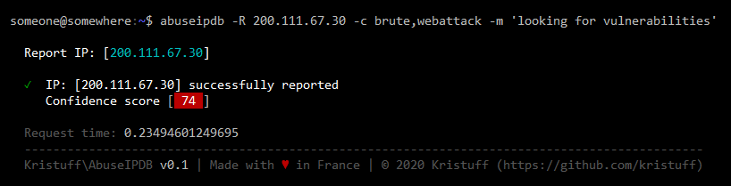
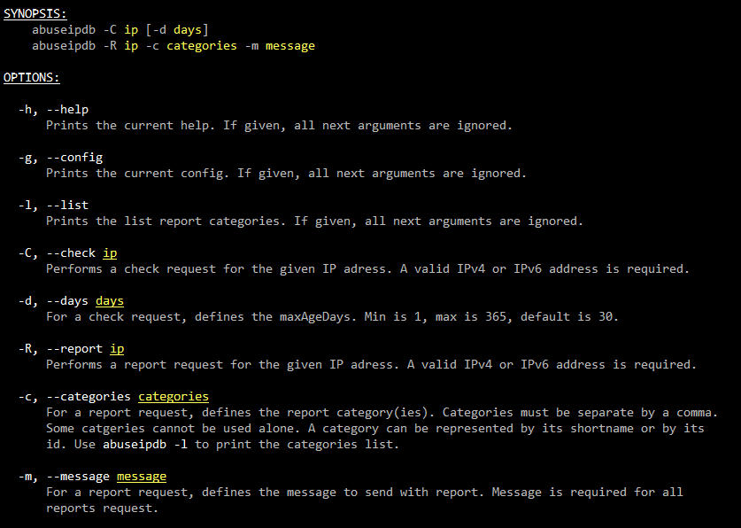
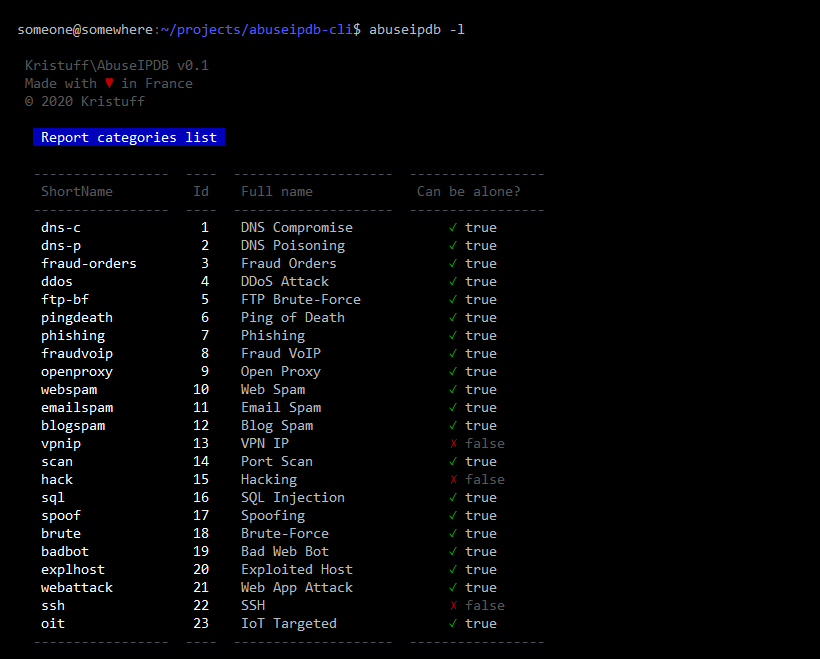

# kristuff/abuse-ipdb
The CLI version of [kristuff/abuseipdb](https://github.com/kristuff/abuseipdb), a mini library to work with the AbuseIPDB API V2

[](https://scrutinizer-ci.com/g/kristuff/abuseipdb-cli/?branch=master)
[](https://scrutinizer-ci.com/g/kristuff/abuseipdb-cli/build-status/master)
[](https://packagist.org/packages/kristuff/abuseipdb-cli)
[](https://packagist.org/packages/kristuff/abuseipdb-cli)



Features
--------
**✓** Single check request

**✓** Single report request

*\[TODO\]* Check block request  

*\[TODO\]* Bulk Report request

Requirements
------------
- PHP >= 7.1
- PHP's cURL  
- A valid [abuseipdb.com](https://abuseipdb.com) account with an API key

Dependencies
------------
- [kristuff/abuse-ipdb](https://github.com/kristuff/abuse-ipdb) The library to communicate with the abuseIPDB API v2
- [kristuff/mishell](https://github.com/kristuff/mishell) Used to build cli colored/tables reports

Install
-------

1. Install with composer

    ```bash
    mkdir abuseipdb-cli
    cd abuseipdb-cli
    composer require kristuff/abuseipdb-cli
    composer install
    ```

2. Edit the `config.json` file locate in the `config` path and define your **api key** and you **user id**.

    ```json
    {
        "api_key": "YOUR ABUSEIPDB API KEY",
        "user_id": "YOUR ABUSEIPDB USER ID",
    }
    ```
3. Make sure the binary file executable

    ```bash
    $ chmod u+x /YOUR_PATH/abuseipdb-cli/bin/abuseipdb
    ```

4. To use it more easily from shell, you could deploy the bin file to `/usr/local/bin/` (need root or administrator permissions)

    ```bash
    # ln -s  /YOUR_PATH/abuseipdb-cli/bin/abuseipdb  /usr/local/bin/
    ```

    Otherwise, replace `abuseipdb` with `./YOUR_PATH_WHERE_YOU_STORE_THIS_PROJECT/bin/abuseipdb` in the following examples.


Documentation
-------------

## 1. Usage



You can print the help with:
```bash
abuseipdb -h
```

## 2. Report categories list



You can print the categories list with:
```bash
abuseipdb -l
```

## 3. Samples

>  As said on [abuseipdb](https://www.abuseipdb.com/check/127.0.0.1), ip `127.0.0.1` is a private IP address you can use for check/report api testing. Make sure you **do not** blacklist an internal IP on your server, otherwise you won't have a good day! 

Check for ip `127.0.0.1` (default is on last 30 days): 
```bash
abuseipdb -C 127.0.0.1 
```

Check for ip `127.0.0.1` in last 365 days: 
```bash
abuseipdb -R 127.0.0.1 -d 365
```


Report ip `127.0.0.1` for `ssh` and `brute` with message `ssh brute force :(`: 
```bash
# with categories shortname
abuseipdb -R 127.0.0.1  -c ssh,brute  -m "ssh brute force :("

# or with categories id
abuseipdb -R 127.0.0.1  -c 22,18  -m "ssh brute force :("
```


License
-------

The MIT License (MIT)

Copyright (c) 2020 Kristuff

Permission is hereby granted, free of charge, to any person obtaining a copy
of this software and associated documentation files (the "Software"), to deal
in the Software without restriction, including without limitation the rights
to use, copy, modify, merge, publish, distribute, sublicense, and/or sell
copies of the Software, and to permit persons to whom the Software is
furnished to do so, subject to the following conditions:

The above copyright notice and this permission notice shall be included in
all copies or substantial portions of the Software.

THE SOFTWARE IS PROVIDED "AS IS", WITHOUT WARRANTY OF ANY KIND, EXPRESS OR
IMPLIED, INCLUDING BUT NOT LIMITED TO THE WARRANTIES OF MERCHANTABILITY,
FITNESS FOR A PARTICULAR PURPOSE AND NONINFRINGEMENT. IN NO EVENT SHALL THE
AUTHORS OR COPYRIGHT HOLDERS BE LIABLE FOR ANY CLAIM, DAMAGES OR OTHER
LIABILITY, WHETHER IN AN ACTION OF CONTRACT, TORT OR OTHERWISE, ARISING FROM,
OUT OF OR IN CONNECTION WITH THE SOFTWARE OR THE USE OR OTHER DEALINGS IN
THE SOFTWARE.
