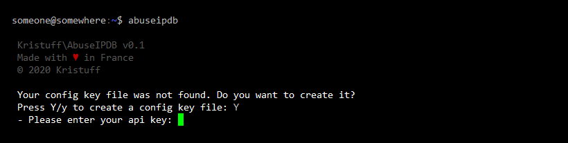

# kristuff/abuseipdb-cli
> A CLI tool to check/report IP adresses with the AbuseIPDB API V2

[](https://scrutinizer-ci.com/g/kristuff/abuseipdb-cli/build-status/master)
[](https://packagist.org/packages/kristuff/abuseipdb-cli)
[](https://packagist.org/packages/kristuff/abuseipdb-cli)


Features
--------
- Single IP check request **✓** 
- IP block check request **✓** 
- Blacklist request **✓** 
- Single report request **✓** 
- Auto cleaning report comment from sensitive data **✓** 
- Easy Fail2ban integration **✓** 

Requirements
------------
- PHP >= 7.1
- PHP's cURL  
- A valid [abuseipdb.com](https://abuseipdb.com) account with an API key

Dependencies
------------
- [kristuff/abuseipdb](https://github.com/kristuff/abuseipdb) A wrapper for abuseIPDB API v2
- [kristuff/mishell](https://github.com/kristuff/mishell) Used to build cli colored/tables reports

Install
-------

1.  Install project and dependencies with composer:

    ```
    $  composer create-project kristuff/abuseipdb-cli
    ```
2.  Make sure the binary file is executable:

    ```
    $ chmod +x /YOUR_PATH/abuseipdb-cli/bin/abuseipdb
    ```

3.  To use it more easily, you could: 
    - deploy the bin file to `/usr/local/bin/` or `/usr/sbin/`:

    >  This task requires **root** or **administrator** permissions.

    ```
    # ln -s  /YOUR_PATH/abuseipdb-cli/bin/abuseipdb  /usr/local/bin/
    ```

    - or create an `alias`:

    ```
    $ alias abuseipdb='php /YOUR_PATH/abuseipdb-cli/bin/abuseipdb'
    ```

    **Otherwise**, replace `abuseipdb` with `php /YOUR_PATH/abuseipdb-cli/bin/abuseipdb` in the following examples.

4.  Run  `abuseipdb` without any parameter. You will be ask to define your **api key** and your **user id**. 

    ```
    $ abuseipdb
    ```
    

    You cound also create a `key.json` file in the `config` path and define your **api key** and you **user id** like this:

    ```json
    {
        "api_key": "YOUR ABUSEIPDB API KEY",
        "user_id": "YOUR ABUSEIPDB USER ID",
    }
    ```
    Then, if you want to change your config, edit the `key.json` or delete that file and run `abuseipdb` again to recreate it.
    
Documentation
-------------

## 1. Usage

### 1.1 Synopsis:

```
abuseipdb -C ip [-d days]
abuseipdb -K network [-d days]
abuseipdb -R ip -c categories -m message
abuseipdb -B [-l limit] [-p]
abuseipdb -L 
abuseipdb -G 
abuseipdb -h 
```

### 1.2 Options:

option                        |  Description
------------                  | --------  
-h, --help                    | Prints the current help. If given, other arguments are ignored.
-G, --config                  | Prints the current config. If given, other arguments are ignored.
-L, --list                    | Prints the list report categories. If given, other arguments are ignored.
-C, --check `ip`              | Performs a check request for the given IP adress. A valid IPv4 or IPv6 address is required.
-d, --days `days`             | For a check or check-block request, defines the maxAgeDays. Min is 1, max is 365, default is 30.
-R, --report `ip`             | Performs a report request for the given IP adress. A valid IPv4 or IPv6 address is required.
-K, --checkblock `newtork`    | Performs a check-block request for the given newtwork. A valid subnet (v4 or v6) denoted with CIDR notation is required.
-c, --categories `categories` | For a report request, defines the report category(ies). Categories must be separate by a comma. Some catgeries cannot be used alone. A category can be represented by its shortname or by its id. Use `abuseipdb -L` to print the categories list.
-m, --message `message`       | For a report request, defines the message to send with report. Message is required for all report requests.
-B, --blacklist | Performs a blacklist request.
-l, --limit `limit`           | For a blacklist request, defines the limit. Default is 1000.
-p, --plaintext               | For a blacklist request, output only ip list as plain text.

## 2. Report categories list

 ShortName       | Id    | Full name          | Can be alone?  
-----------------|-------|--------------------|----------------
 dns-c           |   1   | DNS Compromise     |      true
 dns-p           |   2   | DNS Poisoning      |      true
 fraud-orders    |   3   | Fraud Orders       |      true
 ddos            |   4   | DDoS Attack        |      true
 ftp-bf          |   5   | FTP Brute-Force    |      true
 pingdeath       |   6   | Ping of Death      |      true
 phishing        |   7   | Phishing           |      true
 fraudvoip       |   8   | Fraud VoIP         |      true
 openproxy       |   9   | Open Proxy         |      true
 webspam         |   10  | Web Spam           |      true
 emailspam       |   11  | Email Spam         |      true
 blogspam        |   12  | Blog Spam          |      true
 vpnip           |   13  | VPN IP             |      ***false***     
 scan            |   14  | Port Scan          |      true
 hack            |   15  | Hacking            |      true     
 sql             |   16  | SQL Injection      |      true
 spoof           |   17  | Spoofing           |      true
 brute           |   18  | Brute-Force        |      true
 badbot          |   19  | Bad Web Bot        |      true
 explhost        |   20  | Exploited Host     |      true
 webattack       |   21  | Web App Attack     |      true
 ssh             |   22  | SSH                |      ***false***     
 oit             |   23  | IoT Targeted       |      true

You can print the categories list with:
```bash
abuseipdb -l
```


## 3. Usage

>  As said on [abuseipdb](https://www.abuseipdb.com/check/127.0.0.1), ip `127.0.0.1` is a private IP address you can use for check/report api testing. Make sure you **do not** blacklist an internal IP on your server, otherwise you won't have a good day! 

Check the ip `127.0.0.1` (default is on last 30 days): 
```
abuseipdb -C 127.0.0.1 
```

Check the ip `127.0.0.1` in last 365 days: 
```
abuseipdb -R 127.0.0.1 -d 365
```

Check the block ip `127.0.0.1`: 
```
abuseipdb -K 127.0.0.1/24
```

Check the block ip `127.0.0.1` in last 15 days: 
```
abuseipdb -K 127.0.0.1/24 -d 15
```


Report the ip `127.0.0.1` for `ssh` and `brute` with message `ssh brute force message`: 
```
# with categories shortname
# arguments order does not matter, these two lines do the same
abuseipdb -R 127.0.0.1  -c ssh,brute  -m "ssh brute force message"
abuseipdb  -m 'ssh brute force message' -c ssh,brute  -R 127.0.0.1

# or with categories id
abuseipdb -R 127.0.0.1  -c 22,18  -m "ssh brute force message"
```

Get a blacklist of 1000 items:
```
abuseipdb -B -l 1000
```

Get a blacklist of 10000 items as plain text (an IP address by line) and save it to file:
```
abuseipdb -Bp -l 10000 > list.txt
# or
abuseipdb --blacklist --plaintext --limit 1000 > list.txt
```


Screenshots
-----------


Coming soon or ...
------------------
- *\[TODO\]* *Option for max number of last reports displayed. Currently 5*
- *\[TODO\]* *Check for unicode support*
- *\[TODO\]* *More options in config: default catgegories, verbose, ...*
- *\[TODO\]* *self_ips config + fail2ban integration documentation*

License
-------

The MIT License (MIT)

Copyright (c) 2020-2021 Kristuff

Permission is hereby granted, free of charge, to any person obtaining a copy
of this software and associated documentation files (the "Software"), to deal
in the Software without restriction, including without limitation the rights
to use, copy, modify, merge, publish, distribute, sublicense, and/or sell
copies of the Software, and to permit persons to whom the Software is
furnished to do so, subject to the following conditions:

The above copyright notice and this permission notice shall be included in
all copies or substantial portions of the Software.

THE SOFTWARE IS PROVIDED "AS IS", WITHOUT WARRANTY OF ANY KIND, EXPRESS OR
IMPLIED, INCLUDING BUT NOT LIMITED TO THE WARRANTIES OF MERCHANTABILITY,
FITNESS FOR A PARTICULAR PURPOSE AND NONINFRINGEMENT. IN NO EVENT SHALL THE
AUTHORS OR COPYRIGHT HOLDERS BE LIABLE FOR ANY CLAIM, DAMAGES OR OTHER
LIABILITY, WHETHER IN AN ACTION OF CONTRACT, TORT OR OTHERWISE, ARISING FROM,
OUT OF OR IN CONNECTION WITH THE SOFTWARE OR THE USE OR OTHER DEALINGS IN
THE SOFTWARE.
