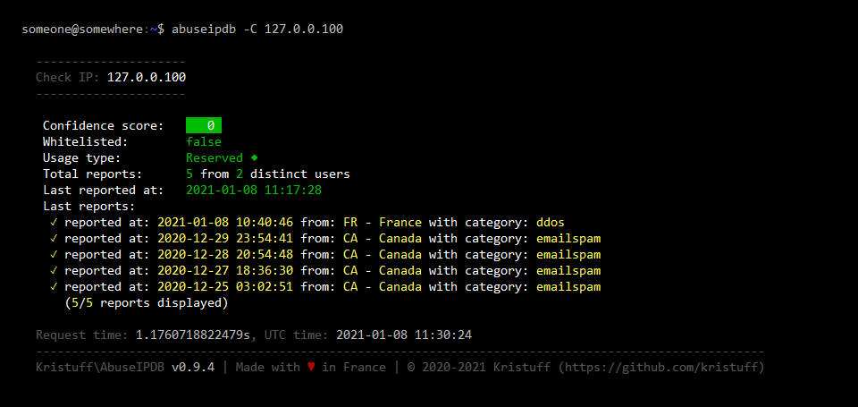
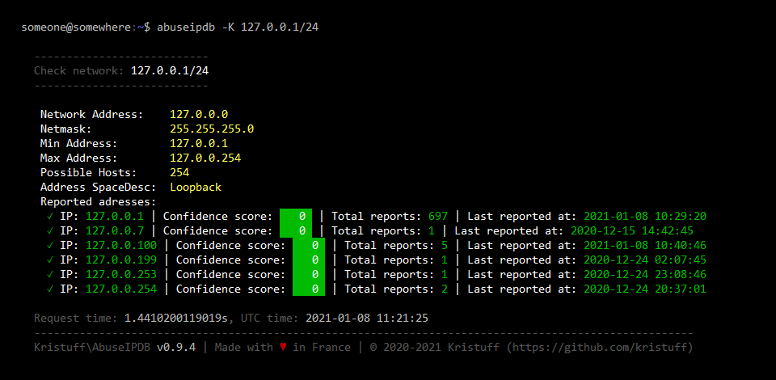
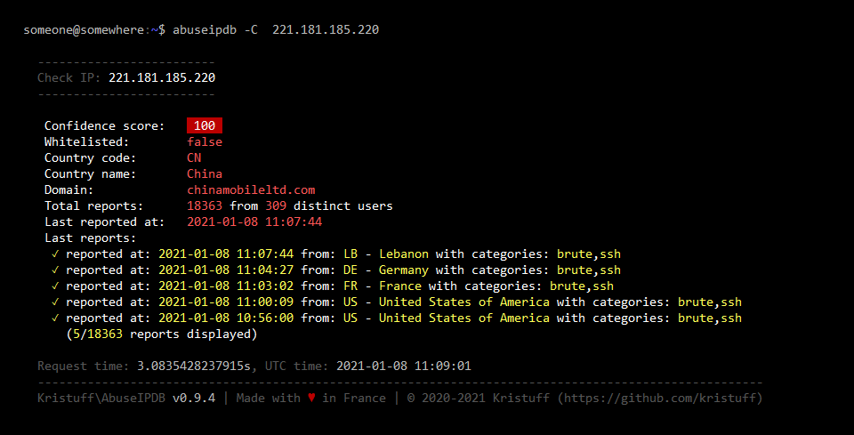
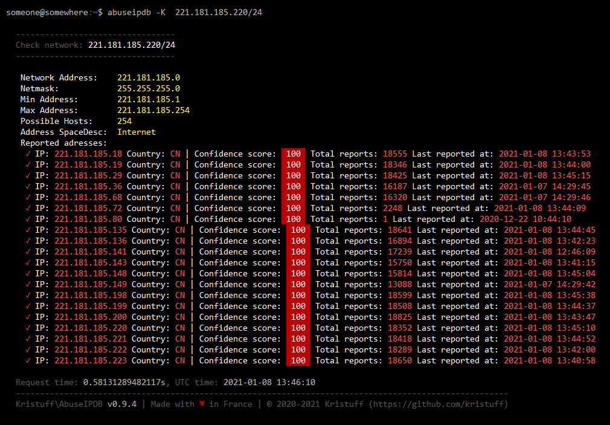
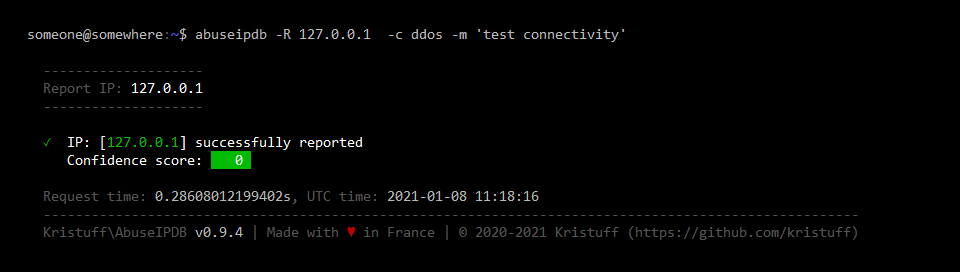
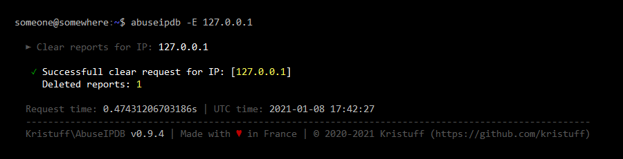
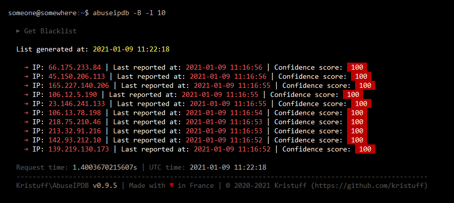
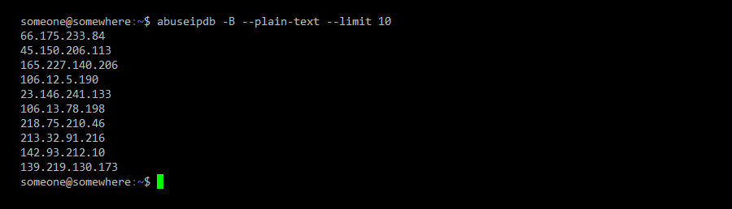

# kristuff/abuseipdb-cli
> A CLI tool to check/report IP addresses with the AbuseIPDB API V2

Features
--------
- Single IP check request **✓** 
- IP block check request **✓** 
- Blacklist request **✓** 
- Single IP report request **✓** 
- Bulk report request (send `csv` file) **✓** 
- Clear IP address request (remove your own reports) **✓**
- Auto cleaning report comments from sensitive data (email, custom ip/domain names list)  **✓** 
- Output: colored reports, JSON or plaintext **✓** 
- Define timeout for cURL internal requests (in config or from command line) **✓**
- Easy Fail2ban integration **✓** 

Requirements
------------
- PHP version: >= 7.1
- PHP's modules: `php-curl`, `php-mbstring`  
- A valid [abuseipdb.com](https://abuseipdb.com) account with an API key
- Composer for install (not required if you install the `.deb` package)

Dependencies
------------
- [kristuff/abuseipdb](https://github.com/kristuff/abuseipdb) A wrapper for abuseIPDB API v2
- [kristuff/mishell](https://github.com/kristuff/mishell) Used to build cli colored/tables reports

More infos
----------
- [Project website](https://kristuff.fr/projects/abuseipdbcli)
- [Api documentation](https://kristuff.fr/projects/abuseipdbcli/doc)
- [Install](https://kristuff.fr/projects/abuseipdbcli/technical#install)
- [Config guide](https://kristuff.fr/projects/abuseipdbcli/technical#configuration)
- [Fail2ban integration](https://kristuff.fr/projects/abuseipdbcli/technical#fail2ban)

Screenshots
-----------

License
-------

The MIT License (MIT)

Copyright (c) 2020-2022 Kristuff

Permission is hereby granted, free of charge, to any person obtaining a copy
of this software and associated documentation files (the "Software"), to deal
in the Software without restriction, including without limitation the rights
to use, copy, modify, merge, publish, distribute, sublicense, and/or sell
copies of the Software, and to permit persons to whom the Software is
furnished to do so, subject to the following conditions:

The above copyright notice and this permission notice shall be included in
all copies or substantial portions of the Software.

THE SOFTWARE IS PROVIDED "AS IS", WITHOUT WARRANTY OF ANY KIND, EXPRESS OR
IMPLIED, INCLUDING BUT NOT LIMITED TO THE WARRANTIES OF MERCHANTABILITY,
FITNESS FOR A PARTICULAR PURPOSE AND NONINFRINGEMENT. IN NO EVENT SHALL THE
AUTHORS OR COPYRIGHT HOLDERS BE LIABLE FOR ANY CLAIM, DAMAGES OR OTHER
LIABILITY, WHETHER IN AN ACTION OF CONTRACT, TORT OR OTHERWISE, ARISING FROM,
OUT OF OR IN CONNECTION WITH THE SOFTWARE OR THE USE OR OTHER DEALINGS IN
THE SOFTWARE.
